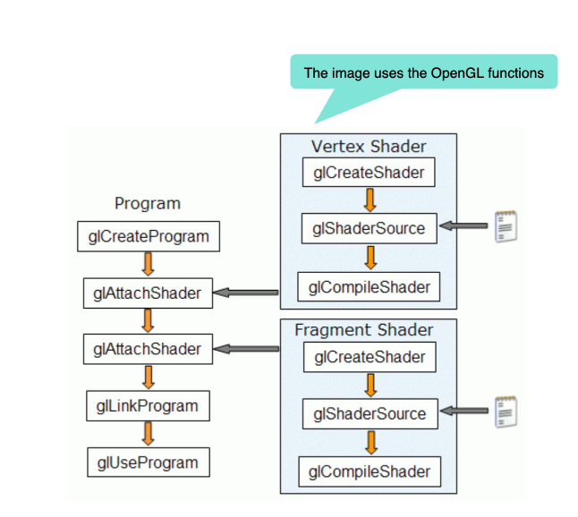

# What does initShaders do? 

gl.createProgram creates a program
Compiles both shaders with gl.compileShader
Connects colors to the program object with gl.attachShader
Links everything together with gl.linkProgram
Finishes by enabling the colorizer with gl.useProgram



## Color Node


```js: 

attribute vec4 vPosition;

void main() {
    gl_PointSize = 1.0; 
    gl_Position = vPosition;
}
````

